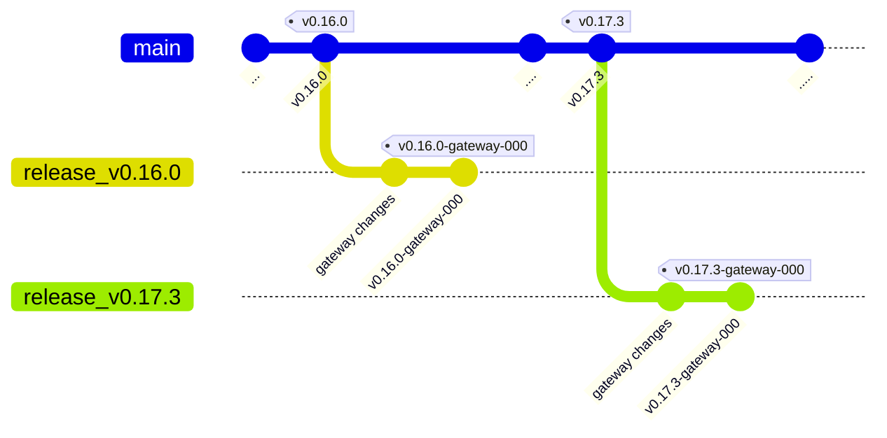

# Nerves GRiSP 2 Support — Gateway Fork

> Forked from [nerves-project/nerves_system_grisp2](https://github.com/nerves-project/nerves_system_grisp2).  
> All gateway-specific specializations live on dedicated branches following the convention described below.

---

## How this fork is structured

This repository tracks the upstream Nerves GRiSP2 system and adds gateway-specific
customizations on top of individual releases. Upstream changes are periodically
merged into `main`, and each supported release gets its own branch where gateway
specializations are applied and tagged.

---

## Syncing with upstream

### 1. Check repo is sync with original repo

Use the **Sync fork** button on the GitHub repository dashboard to pull in the
latest commits from upstream into `main`. This covers commits but **not tags**.

### 2. Update repository tags

Tags are not updated by the GitHub sync button — do this from the command line.

#### 2.1. Ensure the upstream remote is configured (once only)

```bash
git remote -v
# If `upstream` is not listed:
git remote add upstream https://github.com/nerves-project/nerves_system_grisp2
```

#### 2.2 Fetch and push the latest upstream tags

```bash
git checkout main
git pull origin main
git fetch --tags upstream
git push --tags
```

> Tags from the upstream project (e.g. `v0.17.3`) are used as the base for gateway branches. Always sync them after merging main.

---

## Creating a gateway specialization branch

Once `main` and tags are up to date, create a branch from the upstream release you want to specialize:

### 1. Create a branch from the release tag

```bash
git checkout -b release_v0.17.3 v0.17.3
```

### 2. Apply gateway-specific changes

Make all necessary customizations for the gateway on this branch (configs, patches, dependencies, etc.). 

> [!ATTENTION]
> Don't forget to update the **VERSION** and **CHANGELOG.md** files with the tag string before tagging. For **CHANGELOG.md** file, the prefix **v** MUST BE added and for **VERSION**, the **v** MUST BE removed (Nerves convention).

### 3. Tag the gateway release (with **v**)

```bash
git tag v0.17.3-gateway-000
git push origin release_v0.17.3 --tags
```

---

## Releases

The project automatically generates `pre-releases` whenever a tag is pushed to the `release_*` branch. Once the pre-release completes successfully, you can:

 * Edit the release
 * Include any relevant information
 * Mark it as a final release

After the release is finalized, it can be used in the gateway project `mix.exs`. For example:

```elixir
      {
        :gateway_grisp2,
        git: "git@github.com:quipu-systems/gateway_grisp2",
        app: false,
        tag: "v0.17.3-gateway-000",
        runtime: false,
        targets: :gateway_grisp2,
      }
```

---

## Conventions

### Naming

| Artifact            | Pattern                  | Example                  |
|---------------------|--------------------------|--------------------------|
| Upstream tag        | `v{major}.{minor}.{patch}` | `v0.17.3`              |
| Gateway branch      | `release_v{major}.{minor}.{patch}` | `release_v0.17.3` |
| Gateway release tag | `{major}.{minor}.{patch}-gateway-{gateway-changes}` | `v0.17.3-gateway-000`   |

### Structure



---

# GRiSP 2 Support

[](https://hex.pm/packages/nerves_system_grisp2)
[](https://github.com/nerves-project/nerves_system_grisp2/actions/workflows/ci.yml)
[](https://api.reuse.software/info/github.com/nerves-project/nerves_system_grisp2)

This is the base Nerves System configuration for the [GRiSP
2](http://grisp.org/).

*This is a work in progress. It may change in backwards incompatible ways and the documentation might be lacking.*

To do:

- [x] Bring up Ethernet
- [x] Bring up WiFi
- [x] Verify RGB LEDs
- [ ] Verify DIP switches
- [ ] Enable 1-Wire and test
- [ ] Verify SPI
- [x] Verify MicroSD card works
- [ ] Verify ATECC608B
- [ ] Verify HW watchdog
- [x] Add ramoops support
- [ ] Review GRiSP2 specs to see what else there is to verify
- [x] Check that `TARGET_GCC_FLAGS` are right
- [x] Update Linux kernel to 5.10
- [x] Update Nerves Toolchain 1.5.0 version
- [x] Implement A/B firmware updates work
- [x] Create example app that uses GRiSP2. See Circuits Quickstart and Nerves Livebook
- [x] Review Linux kernel options and compare with other systems
- [ ] Clean up debug and low hanging items to improve boot time
- [ ] Clean up changes to GRiSP repositories and send PRs
- [x] Use GRiSP serial number in hostname

| Feature              | Description                     |
| -------------------- | ------------------------------- |
| CPU                  | NXP iMX6ULL, ARM Cortex-A7 @ 696 MHz |
| Memory               | 512 MB DRAM                     |
| Storage              | 4 GB eMMC and optional MicroSD  |
| Linux kernel         | 5.15 w/ Phytec patches          |
| IEx terminal         | ttymxc0                         |
| GPIO, I2C, SPI       | Yes - [Elixir Circuits](https://github.com/elixir-circuits) |
| LEDs                 | Yes - named `red:indicator-1`, etc. in `sys/class/leds` |
| ADC                  | -                               |
| PWM                  | -                               |
| UART                 | ttymxc0-ttymxc5                 |
| Camera               | None                            |
| Ethernet             | Yes                             |
| WiFi                 | Yes - 2.4GHz station mode (no Soft-AP) (R8188EU) |
| HW Watchdog          | i.MX6 watchdog enabled on boot  |

## Using

The most common way of using this Nerves System is create a project with `mix
nerves.new` and to export `MIX_TARGET=grisp2`. See the [Getting started
guide](https://hexdocs.pm/nerves/getting-started.html#creating-a-new-nerves-app)
for more information.

If you need custom modifications to this system for your device, clone this
repository and update as described in [Making custom
systems](https://hexdocs.pm/nerves/systems.html#customizing-your-own-nerves-system)

## Boot notes

This system isn't ready for general use. If you know how to build a Nerves
system, then it will probably be a little frustrating, but you'll get something
to boot.

1. Build the system
2. Create a test Nerves project or try `circuits_quickstart` to use it.
3. Build the project with `mix firmware`. Then run `mix firmware.image` to get
   an image file.
4. gzip the image file and copy to a FAT-formatted MicroSD card.
6. Connect the GRiSP2's USB port to your computer and open up a terminal session
   (115200 8N1).
7. Boot the GRiSP2 and press a key to break into the bootloader.
8. Run:

    ```
    uncompress /mnt/mmc/myfirmware.img.gz /dev/mmc1
    reset
    ```
9. Now you should be able to use `mix upload` or `./upload.sh` for subsequent
   updates. The firmware is set to auto-validate.

## Console access

GRISP2 will create two virtual UART ports when plugged in. The second of these will contain a system console where you can interact with BareBox and the Elixir Shell.
On Linux, this looks like:

```
/dev/ttyUSB0
/dev/ttyUSB1
```

You can connect via `picocom` with:

```
picocom /dev/ttyUSB1 115200
```

>NOTE: This differs from the Official GRISP2 guide in that we don't need the `--echo` flag.

## PMOD usage

The GRiSP 2 has five PMOD interfaces. GPIO pins should all be accessible. Pins
for other functions are configured for those functions:

* UART PMOD - access the UART pins via `ttymcx3`
* I2C PMOD - access I2C via `i2c-1`
* SPI1 PMOD - access SPI via `spidev0.0`
* SPI2 PMOD - access SPI via `spidev0.1`

## Provisioning devices

TODO: The GRiSP 2 includes an ATECC608A so provisioning the board for use with
NervesHub can be done without setting U-Boot environment variables.

## Linux versions

*TBD*

We're currently using PHYTEC's Linux kernel fork from
[git.phytec.de/linux-mainline](git://git.phytec.de/linux-mainline).
